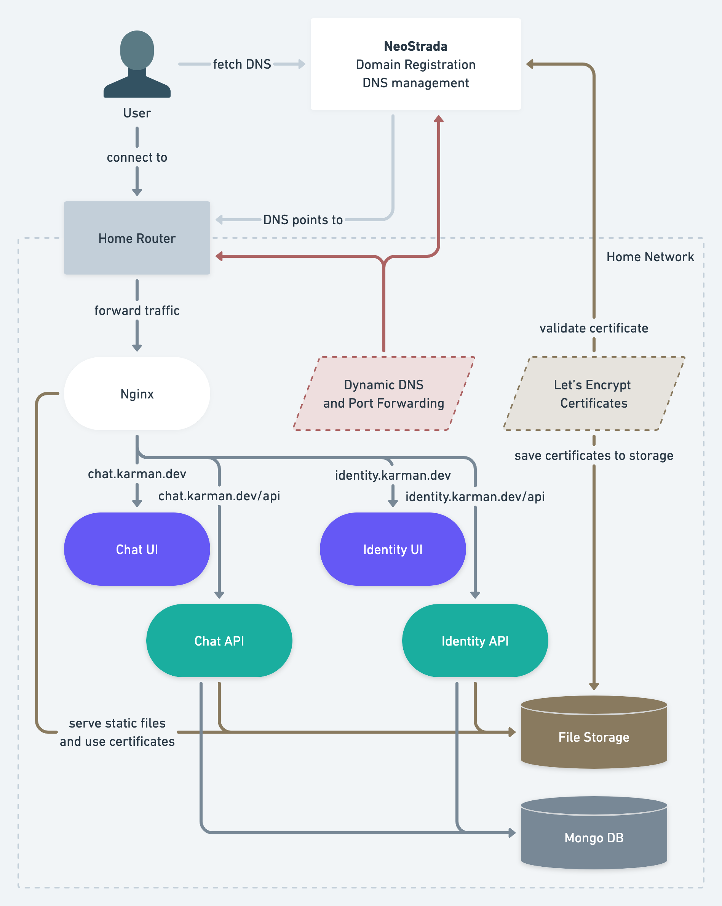

# Karman Home
A set of applications that function as a home server for running fullstack workloads.

You can find the landing page at: [home.karman.dev](https://home.karman.dev)

The Karman Home stack uses nginx as a reverse proxy, Let's Encrypt for the tls certificates, microservice build using NodeJS TypeScript with the Express framework, and Typescripted React for the frontend web applications. The overall architecture is described in the image below.



## Running Karman Home
First make sure you set up your DNS provider to point to your router and setup port forwarding to your machine. You can find an automated script for this in `ingress/dns`.

Secondly make sure you have generated a valid Let's Encrypt certificate. More information can be found in `ingress/certificate`.

Then, make sure you have docker daemon running. Now you can start the applications locally:
```bash
docker-compose up --build --remove-orphans -d
```

To stop the application, run the following command. Make sure to also disable the port forwarding and remove the DNS records.
```bash
docker-compose down
```
